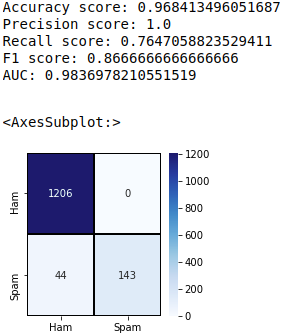
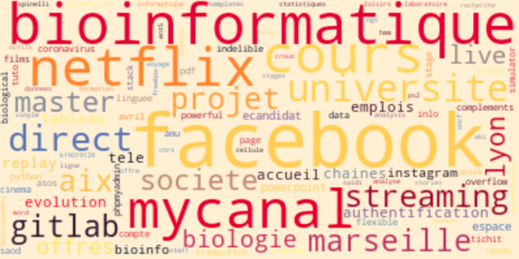
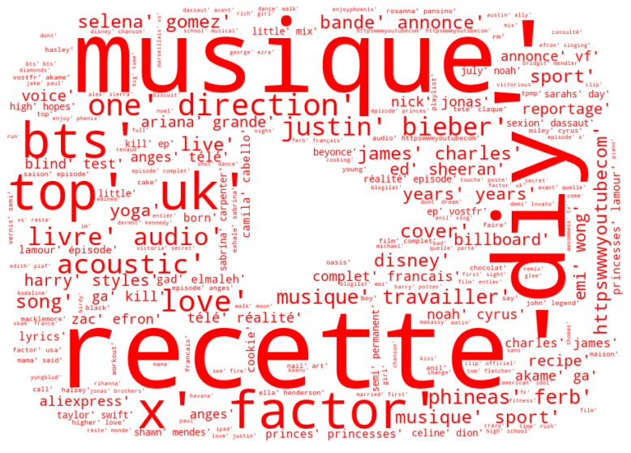
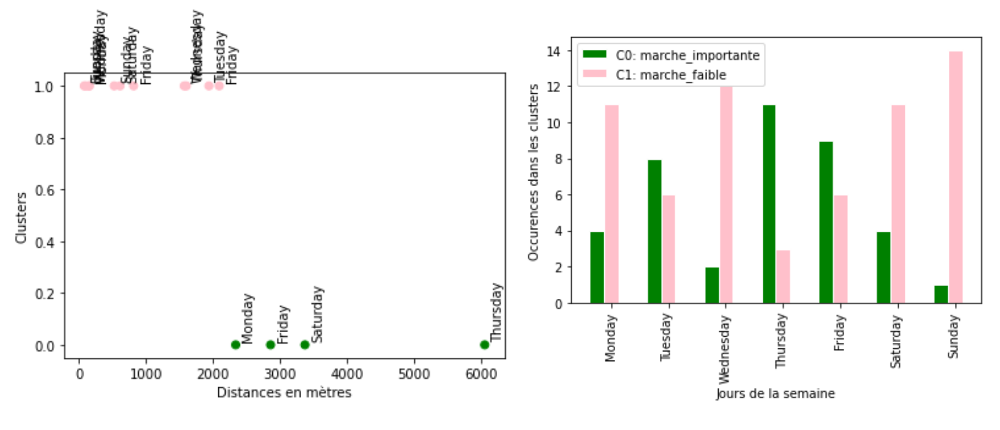

# Google_Takeout_data_mining
Knowledge extraction from Google Takeout

The amount of data we produce every day is growing exponentially. Especially from smartphones, which contain a multitude of sophisticated sensors, from barometers and gyroscopes to GPS navigation and ambient light sensors. All of these technologies provide mobile data collection methods for apps so they can use your data to enrich your user experience. 

TakeOut by Google allows you to export your Google products. Exports are available as zip formatted downloads. Downloads may be very time consuming - Google will notify you via email after downloads are complete.

Google TakeOut can be found [here](https://takeout.google.com/settings/takeout).

You can export and download your data from the Google products you use, such as your:

    - Email
    - Documents
    - Calendar 
    - Photos
    - YouTube videos
    - Data about registration and account activity
    - ...


This project aims to illustrate how the huge amount of data collected by Google, could be used to improve user experience but is also a door open on user private life.  

Please, check the content of your Google TakeOut and use our notebooks to investigating how collection data could be used by GAAFA or Netflix, Youtube, or other companies owner of applications you use.

# How to launch a notebook

```
pip install jupyter #installation
jupyter-notebook file.ipynb #run file.ipynb
```
Replace file by the notebook path.

# Gmail

Gmail is a free email service developed by Google. Google's mail servers automatically scan emails for multiple purposes, including to filter spam and malware, and to add context-sensitive advertisements next to emails.  
By using ```gmail_data_mining.ipynb``` on your ```gmail.json```, you will better understand the process underlying the filtering of your mails.

### installation required
```
pip install pandas
pip install matplotlib
pip install mailbox
pip install deep-translator
pip install scikit-learn
pip install seaborn
pip install nltk

```

Here we used, NLP algorithm to see if we could filter potential new spam received in a box mail. 
The results are shown below. This is a confusion matrix obtained on a test dataset after supervised learning.
<p align="center">

</p>
Regarding prediction metrics (accuracy, recall, and precision), our predictions are quite good. Notice that, results would be even better if we had a more exhaustive training dataset.

By collecting your emails, Google improves its training dataset and is now be able to filter spam but also promotion or social networks mails.
Of course, by collecting them they also have access to potential private or sensible contents.

# Browser history

Google is the most used search engine on the World Wide Web across all platforms, with 92.16% market share as of December 2020, handling more than 5.4 billion searches each day.  
By downloading your Google Takeout you will find it in ```MonActivité.html```.  
By using ```Browser_history_data_mining.ipynb``` and ```parser_MonActivite.py```, you will be able to easily observe your frequent research.  

### installation required
```
pip install pandas
pip install numpy
pip install matplotlib
pip install texthero 
pip install nltk
pip install beautifulsoup4
```
To visualize your frequent research, you could build a word cloud, as shown below.  
In this kind of visualization, word size is proportional to the frequency on which you search a word/expression in your browser.

<p align="center">

</p>

Obviously, by using our notebook and by building your word cloud you will observe your centers of interest.
All your researches are stored by Google in such a way it could be recovering a website in your browser history but also tracking your centers of interest and finally do pop up ad links to your hobbits on your favorite social network.

If you looking for an alternative to Google to surf on the internet, Qwant might your new friend. Qwant is a French search engine, launched in July 2013 and operated from Paris. It is one of the few EU-based search engines with its own indexing engine. It claims that it does not employ user tracking or personalize search results to avoid trapping users in a filter bubble. The search engine is available in 26 languages.


# Youtube history

YouTube is an American online video-sharing platform, created in February 2005. Similarly to your web browser, you can access your youtube history by downloading your TakeOut. 

### installation required
```
pip install pandas
pip install numpy
pip install matplotlib
pip install keras
pip install scikit-learn
pip install wordcloud
pip install PIL
pip install tdlextract
pip install nltk
pip install beautifulsoup4
```

By using the same approach as Browser History our notebook ```YT_data_mining.ipynb``` allows you to investigate your centers of interest-based on your Youtube research. 
File concerned by this notebook is ```watch_history.json```. Careful, YT.jpg need to be in the same directory as the notebook.

<p align="center">

</p>

# Location History

By using the notebook ```location_history_data_mining.ipynb```, you will be allowed to import location_history.json and used its contents to visualize your data on an interactive map.

### installation required
```
pip install pandas
pip install numpy
pip install matplotlib
pip install seaborn
pip install folium
pip install jupyter-dash
```
Obviously, our tool is quite fun to remember parts of the world you have visited. 

Here we show a map time series from GPS data obtained with a European road trip. 
<p align="center">

</p>
However, you should also be aware that this kind of visualization gives easy access to your daily habits.  By using a logical filter such as "from 0:00 am to 5:00 am I stay still and I am at home" our tool allows you to investigate your home location. Or by checking your position during work hours, it informs us about your job and potentially on your way of life.  

Currently, our app needs manual treatment so a possible perspective of our work would be to develop a machine-learning algorithm able to detect hotspots often print on this kind of image and so able to infer informative locations that might be useful for better understand the user and objectively adapt his experience.


# Google Fit

Fit is a fitness community connecting fitness trainers in the world with people looking to improve their health. The app provides a fun and free fitness challenges, coaching, and training.  
This app is less used than apps previously studied. We choose to investigate the contents of data linked to this app to better understand how alternative apps are involved in data collection.


### installation required
```
apt install gdal-bin python3-gdal python3-gdal --quiet
apt install python3-rtree --quiet
pip install git+git://github.com/geopandas/geopandas.git --quiet
pip install descartes --quiet
pip install geopy
pip install plotly_express
pip install ipython-autotime
pip install sklearn
pip install sklearn.preprocessing

```
By using a Kmeans clustering, we separate the data into 2 clusters:  
    - high activity  
    - low activity  
It allows you to find out which parts of the week you are most active.  
    
<p align="center">

</p>

Combine with location history this kind of data might be used to even better understand user's habits.
Furthermore, alternative apps are often own and develop by a startup or little companies. These companies cannot afford Google financial resources to protect data collected, potentially leading to data leaks ([as shown here](https://www.businessinsider.fr/appli-fitness-polar-expose-donnees-localisation-2018)).


# Discussion

A cornerstone of data protection law is that personal data shall be collected for specified purposes and not used in a way incompatible with those purposes.  Use for incompatible purposes should only be allowed insofar as it is laid down by law and necessary to pursue specific public interests.
Data protection laws around the world aim to give back individuals control over the data, empowering individuals to know how their data is being used, by whom and why, giving them control over how their personal data is being processed and used. Very soon, it will become incredibly risky for companies to navigate through data privacy laws unprepared. Companies will be at risk of fines and lawsuits, not to mention company reputation and customer loyalty.
Life in the Information Age is all about making compromises, whether you like it or not. There is no set-it-and-forget-it option on a sliding scale of privacy versus convenience, as the scale itself is constantly changing. As we show previously, we are giving away a lot more data than we realize, and it's not necessarily something we should just accept.

Delete your Google location history and turn it off so that it won't be a problem in the future. Google provides instructions on how to do this, and it's not too difficult. It could impact your search experience in the future as a lot of Google features work well because they remember where you have been. If you don't want to lose all your location data, you can always keep the location turned on to keep it recording, then download it through Google Takeout and clear your history multiple times a year.

# Sources

- [data privacy](https://dataprivacymanager.net/5-things-you-need-to-know-about-data-privacy/)  
- [User experience](https://knowledge.wharton.upenn.edu/article/the-user-experience-why-data-not-just-design-hits-the-sweet-spot/)  
- [data collection](https://clevertap.com/blog/mobile-data-collection/)  
- [General Data Protection Regulation](https://gdpr-info.eu/)


# Autors
Adeline, Elsa, Fanny, Fatima, Arnaud
