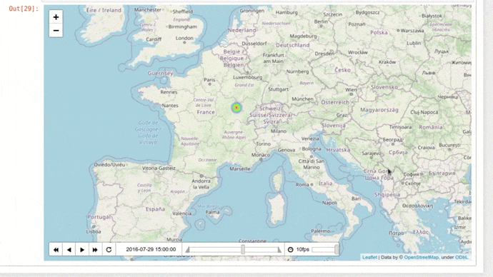

# Google_Takeout_data_mining
Knowledge extraction from Google Takeout

The amount of data we produce every day is growing exponentially. Especially from smartphones, which contain a multitude of sophisticated sensors, from barometers and gyroscopes to GPS navigation and ambient light sensors. All of these technologies provide mobile data collection methods for apps so they can use your data to enrich your user experience. 

TakeOut by Google allows you to export your Google products. Exports are available as zip formatted downloads. Downloads may be very time consuming - Google will notify you via email after downloads are complete.

Google TakeOut can be found [here](https://takeout.google.com/settings/takeout).

You can export and download your data from the Google products you use, such as your:

    - Email
    - Documents
    - Calendar 
    - Photos
    - YouTube videos
    - Data about registration and account activity
    - ...


This project aims to illustrate how the huge amount of data collected by Google, could be used to improve user experience but is also a door open on user private life.  

Please, check the content of your Google TakeOut and use our notebooks to investigating how collection data could be used by GAAFA or Netflix, Youtube, or other companies owner of applications you use.

# Location History

By using the notebook ```location_history_data_mining.ipynb```, you will be allowed to import location_history.json and used its contents to visualize your data on an interactive map.

### installation required
```
pip install 
pip install 

```
Obviously, our tool is quite fun to remember parts of the world you have visited. 

Here we show a map time series get from GPS data obtained with a European road trip. 



However, you should also be aware that this kind of visualization gives easy access to your daily habits.  By using a logical filter such as "from 0:00 am to 5:00 am I stay still and I am at home" our tool allows you to investigate your home location. Or by checking your position during work hours, it informs us about your job and potentially on your way of life.  

Currently, our app needs manual treatment so a possible perspective of our work would be to develop a machine-learning algorithm able to detect hotspots often print on this kind of image and so able to infer informative locations that might be useful for better understand the user and objectively adapt his experience.


# Discussion

A cornerstone of data protection law is that personal data shall be collected for specified purposes and not used in a way incompatible with those purposes.  Use for incompatible purposes should only be allowed insofar as it is laid down by law and necessary to pursue specific public interests.
Data protection laws around the world aim to give back individuals control over the data, empowering individuals to know how their data is being used, by whom and why, giving them control over how their personal data is being processed and used. Very soon, it will become incredibly risky for companies to navigate through data privacy laws unprepared. Companies will be at risk of fines and lawsuits, not to mention company reputation and customer loyalty.
Life in the Information Age is all about making compromises, whether you like it or not. There is no set-it-and-forget-it option on a sliding scale of privacy versus convenience, as the scale itself is constantly changing. As we show previously, we are giving away a lot more data than we realize, and it's not necessarily something we should just accept.

Delete your Google location history and turn it off so that it won't be a problem in the future. Google provides instructions on how to do this, and it's not too difficult. It could impact your search experience in the future as a lot of Google features work well because they remember where you have been. If you don't want to lose all your location data, you can always keep the location turned on to keep it recording, then download it through Google Takeout and clear your history multiple times a year.

# Autors
Adeline, Elsa, Fanny, Fatima, Arnaud
